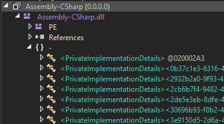
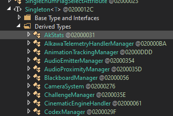

# Unity

A guide to making autosplitters for Unity games.

I'm not an expert. There very well may be things that are wrong, or can be done better, that I've talked about here. If that's the case, please raise it with me! I'm always happy to learn more. *Contributions are welcome!*

### Assumed Skills

- Programming skills, this is not a programming tutorial. This is a reverse engineering tutorial.
- Cheat Engine
- Pointer paths, basic memory skills
- Some understanding of game engines
- Experience with ASL and making autosplitters

### How to ask for help

If you don't know how something works, or are confused, or need assistance, follow this guide:

1. Search on the [Speedrun Tool Development discord](https://discord.com/invite/N6wv8pW) for keywords if others have already asked similar questions.
2. Look at [existing autosplitters](https://github.com/LiveSplit/LiveSplit.AutoSplitters/blob/master/LiveSplit.AutoSplitters.xml) to see if they have solved the problem you're asking.
3. Condense your question to be as specific as possible, about a specific scenario. People will be more inclined to help you if it's obvious you have given the problem considerable thought.
4. Account for the following pitfalls when asking questions:
   1. [Don't ask to ask, just ask](https://dontasktoask.com/)
   2. [The XY Problem](https://xyproblem.info/)
5. Ask your question in the channel that is most applicable to your issue.
   1. #reverse-engineering
   2. #memory
   3. #autosplitters

***The best way you can learn something is by doing it yourself.***

I couldn't tell you how many hours I have spent at this computer headbashing Cheat Engine trying to figure out how everything works. While frustrating in the moment, I knew that it would be worth it in the end, since I now understand things at a much deeper level than I previously did. I sincerely encourage you to try and figure things out yourself first (feel free to take advantage of existing resources, such as this guide, or steps 1 and 2 in the above guide).

## Overview

You have a game, and you want to make an autosplitter for it. You may have been pointer scanning up to this point, and while it can work, it severely limits what you're able to do. Instead of guessing in the dark, we can construct intelligent methods to find the values we need!

The way that we will do this is we will:
1. [Setup asl-help and check scenes]()
1. [Open the game's code](#setup)
1. [Find good static properties](#finding-base-addresses)
1. [Find useful properties](#dumping-headers-sdk)
1. [Write an autosplitter with this](#writing-an-autosplitter)

### Theory

Admittedly, I don't know much about the theory of Unity games. But I can give you some practical information which will help, but it's less important than following information.

#### Recognising a Unity game

We can take a look at the file structure and recognise a Unity game:
- `<Game Name>_Data` folder
- `<Game Name>.exe` the game's executable

If there is a `GameAssembly.dll` file, then your game is compiled with "IL2CPP", which is explained in the next section.
If there's not, then it's not compiled with that.

Right click the game's executable and go to Details and look under `File version` - here you can see
the Unity engine version it was made with, too.

#### IL Code and IL2CPP

Unity games are written in C#, and compile to IL code (Intermediate Language). This IL code is decompile-able
with tools like [dnSpy](https://github.com/dnSpyEx/dnSpy/releases/tag/v6.4.1), so we can read the C# code of
Unity games directly (and even make changes to the code and save it back).

Some games, usually those which release to other consoles, are compiled further with `IL2CPP`, or expanded
"Intermediate Language To C Plus Plus". This will compile the IL code to CPP and then to assembly code. This cannot be
decompiled, so if the game you're looking at uses this, you can't read the code. You *can* look at the structure of
classes and whatnot, which is crucial.

#### SceneManager, GameObjects, and MonoBehaviors

A [Scene](https://docs.unity3d.com/Manual/CreatingScenes.html) in unity can effectively thought of as a
level or world. The Unity docs give a more correct explanation. The SceneManager handles loading and managing scenes.
There is always an "active" scene, and there's a list of scenes which are already loaded, and a list of scenes which are loading.

GameObjects and MonoBehaviors are things in a scene. With the current version of `asl-help``, we are not able to get
and look at these directly (at least not exposed via the api, you can do it by manually searching if you know how).

Hopefully, your game isn't dependent on those objects. If it is, you're kind of shit-outta-luck.

## Setup & Tool Descriptions

### Basics

- DebugView
- Cheat Engine

### dnSpy

[dnSpy](https://github.com/dnSpyEx/dnSpy/releases/tag/v6.4.1) will allow us to take a game's DLLs and look at the
code structure.

### asl-help

[asl-help](https://github.com/just-ero/asl-help) is the library which will do all of the heavy lifting for us on the ASL
side. We'll install the binary (located at `/lib/asl-help` at the time of writing) into our `LiveSplit/Components` folder,
and load that into our ASL file like so:

```cs
Assembly.Load(File.ReadAllBytes("Components/asl-help")).CreateInstance("Unity");
```

### Il2CppDumper

If the game is compiled with IL2CPP, then we need to decompile the DLLs back out into something we can view in dnSpy. The most consistent tool for that job I've found is [Il2CppDumper](https://github.com/Perfare/Il2CppDumper).

## Setup asl-help and Check Scenes

This tutorial will differ significantly to the unreal one - we will be using the autosplitter to help do our introspection into the game.

Here's the base `.asl` you'll want to use (this tutorial assumes you have basic asl experience):
```cs
state("YourGame") { }

startup
{
    // Load asl-help binary and instantiate it
    // Will inject code into the asl in the background
    Assembly.Load(File.ReadAllBytes("Components/asl-help")).CreateInstance("Unity");
    // Set the helper to load the scene manager, you probably want this
    // (the helper is set at vars.Helper automagically)
    vars.Helper.LoadSceneManager = true;
}

init
{
    // This is where we will load custom properties from the code, empty for now
    vars.Helper.TryLoad = (Func<dynamic, bool>)(mono =>
    {
        return true;
    });
}

update
{
    // Get the current active scene's name and set it to `current.activeScene`
    // Sometimes, it is null, so fallback to old value
    current.activeScene = vars.Helper.Scenes.Active.Name ?? current.activeScene;
    // Usually the scene that's loading, a bit jank in this version of asl-help
    current.loadingScene = vars.Helper.Scenes.Loaded[0].Name ?? current.loadingScene;

    // Log changes to the active scene
    if (old.activeScene != current.activeScene) {
        vars.Log("activeScene: " + old.activeScene + " -> " + current.activeScene);
    }
    if (old.loadingScene != current.loadingScene) {
        vars.Log("loadingScene: " + old.loadingScene + " -> " + current.loadingScene);
    }
}

onStart
{
    vars.Log("activeScene: " + current.activeScene);
    vars.Log("loadingScene: " + current.loadingScene);
}
```

Play the game and try to trigger scene changes. These scene values may be useful to you. You can also start the timer to see the current value of the scenes. Here's some common ways they are useful:
- If the loading scene and active scene are different, that might indicate a load.
- Each scene may be a different level or room, so you might want to split on scene changes.

For more complicated games, these values are somewhat likely to be nonsense. For small games, these are likely to be great.

### I can't read scene names

If it's not working, then your gmae might be ab it bugged, I've noticed some jank with these methods. Here's one way I had to work around it:

```cs
// a custom function defined in init, the `scene` is the scene's address (e.g. vars.Helper.Scenes.Active.Address)
vars.ReadSceneName = (Func<IntPtr, string>)(scene => {
    string name = vars.Helper.ReadString(256, ReadStringType.UTF8, scene + 0x38);
    return name == "" ? null : name;
});
```

I believe this was because the offset to the scene's name was incorrect, so I had to manually read it (0x38 in this case). I've had this with a few games before. I would print out the `.Address` of the scene that's not working and then manually search for the scene name.

## Open the game's code

Most likely, for any reasonably complex game or autosplitter, the scenes will not be enough to achieve what is needed. So let's look at the internals of the game.

You can view them in Cheat Engine -> `Mono` -> `.Net Info` for both normal and IL2CPP games, but the usefulness of this is limited.

Open the `Game/Game_Data/Managed` folder if it exists (if it doesn't, then you have an IL2CPP game, follow the instructions below), and you will see a bunch of `.dll` files. Any of these can be opened to see the contents, but almost always the game code is in `Assembly-CSharp.dll`. Open that in [dnSpy](https://github.com/dnSpyEx/dnSpy/releases/tag/v6.4.1). Then expand the image and the `{}` module, as it is most likely to contain your code. Each item under that is a class / script.



### Dumping IL2CPP code

Use [Il2CppDumper](https://github.com/Perfare/Il2CppDumper) to dump the `.dll`s of the game to a folder. Here's an example run:

```shell
> .\Il2CppDumper.exe 'E:\<PATH TO GAME>\GameAssembly.dll' 'E:\<PATH TO GAME>\<GAME>_Data\il2cpp_data\Metadata\global-metadata.dat'
```
The `.dll`s will be in the `DummyDll` folder next to the `Il2CppDumper.exe`.

### Other places to look

You may need to open other images (that is, `.dll` files other than `Assembly-CSharp.dll`) or other modules (thatr is, dropdowns other than `{ }`) to look for your code.

### What's inside?

Inside this you will see:
- all the scripts and classes the game has
- the methods, fields, and static properties each class has
- the game's enums
- if not IL2CPP, the logic inside each method

This is, obviously, incredibly useful.

## Find good static properties

Now, here's how we can use asl-help:

```cs
init
{
    // we will attempt to run the function at TryLoad when the game is opened
    vars.Helper.TryLoad = (Func<dynamic, bool>)(mono =>
    {
        // Load some classes from memory
        // This will load information about their propeties, the offsets to them
        //    and the addresses to their static properties
        var pgm = mono["PogoGameManager", 1];
        var chd = mono["ChapterDescriptor"];
        var pc = mono["PlayerController"];
        var gpt = mono["GameProgressTracker"];

        // We set the value 'chapter' to an `int`
        // We start from a static variable, in this case it's PogoGameManager.GameInstance
        // Then we can go from there to any property on that
        // In this case we're getting PogoGameManager.GameInstance.currentChapter.Number and setting it to "chapter"
        vars.Helper["chapter"] = mono.Make<int>(
            // the base class
            pgm,
            // a static property of that class
            "GameInstance",
            // and then go down the chain
            pgm["currentChapter"],
            chd["Number"]
        );
    });
}

onStart
{
    // we can then access the variables we got from `old` and `current` as normal
    vars.Log(current.chapter);
}
```

We start from static properties, then we access any properties we want from there.

Most of the work that goes into reverse engineering unity games is finding properties we want, then finding static properties that will let us access them. Alternatively, we can start from static variables and see what properties that that lets us access. In the above example, I found the `PogoGameManager` (more on this below), found the GameInstance, and then saw `currentChapter`, which was very promising, since I was looking for what chapter the player was up to.

Next, we need to understand the `Singleton` pattern. That will be classes that have a static reference to an instance of itself. Like so:

```cs
public class MyClass
{
    private static MyClass m_instance;

    private int some_other_fields;
}
```

So, to find good static properties, we have a few tricks.
- Classes that end in `Manager`, `Controller`, `Instance`, etc., are generally management classes that will often be Singletons or contain static references to other classes.
- There may be a class called Singleton which other classes will extend. This is a gold mine. In `dnSpy` you can view the classes which are extended from a class, so we can use that to see all the singletons in the project. See the below image - all of those classes will have a static reference to itself.



*If there are no static variables in the game you're looking at, you're shit outta luck I'm afraid. This tutorial assumes you have some*

wip