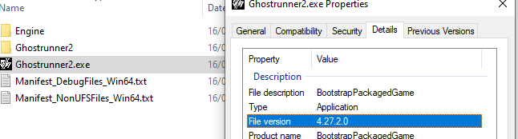
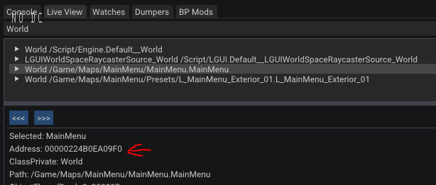
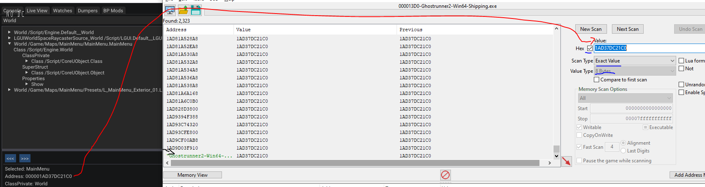
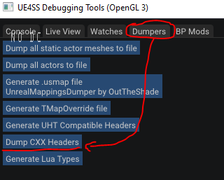
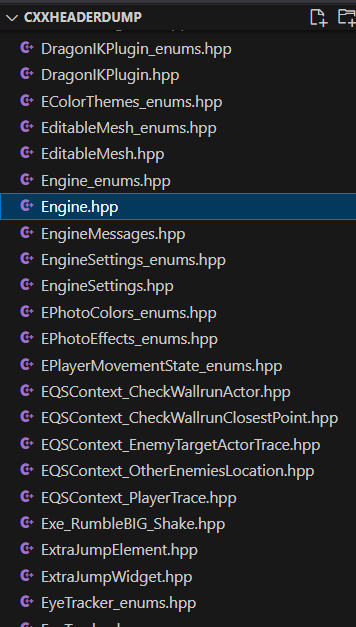

# Unreal Engine

A guide to making autosplitters for Unreal Engine games.

I'm not an expert. There very well may be things that are wrong, or can be done better,
that I've talked about here. If that's the case, please raise it with me! I'm always
happy to learn more. *Contributions are welcome!*

### Assumed Skills

- Programming skills, this is not a programming tutorial. This is a reverse engineering tutorial.
- Cheat Engine
- Pointer paths, basic memory skills
- Some understanding of game engines
- Experience with ASL and making autosplitters

### How to ask for help

If you don't know how something works, or are confused, or need assistance, follow this guide:

1. Search on the [Speedrun Tool Development discord](https://discord.com/invite/N6wv8pW) for keywords if others have already asked similar questions.
2. Look at [existing autosplitters](https://github.com/LiveSplit/LiveSplit.AutoSplitters/blob/master/LiveSplit.AutoSplitters.xml) to see if they have solved the problem you're asking.
3. Condense your question to be as specific as possible, about a specific scenario. People will be more inclined to help you if it's obvious you have given the problem considerable thought.
4. Account for the following pitfalls when asking questions:
   1. [Don't ask to ask, just ask](https://dontasktoask.com/)
   2. [The XY Problem](https://xyproblem.info/)
5. Ask your question in the channel that is most applicable to your issue.
   1. #reverse-engineering
   2. #memory
   3. #autosplitters

***The best way you can learn something is by doing it yourself.***

I couldn't tell you how many hours I have spent at this computer headbashing
Cheat Engine trying to figure out how everything works. While frustrating in
the moment, I knew that it would be worth it in the end, since I now understand
things at a much deeper level than I previously did. I sincerely encourage you
to try and figure things out yourself first (feel free to take advantage of
existing resources, such as this guide, or steps 1 and 2 in the above guide).

## Overview

You have a game, and you want to make an autosplitter for it. You may have been
pointer scanning up to this point, and while it can work, it severely limits what
you're able to do. Instead of guessing in the dark, we can construct intelligent
methods to find the values we need!

The way that we will do this is we will:
1. [Setup reverse engineering tools on the game](#setup)
2. [Find basic addresses (common across all UE games)](#finding-base-addresses)
3. [Dump information about the game's code structure (an SDK)](#dumping-headers-sdk)
4. [Search the SDK for fields that are helpful](#navigating-the-sdk)
5. [Construct pointer paths from the base addresses with the SDK](#constructing-pointer-paths)
6. [Write an autosplitter with this](#writing-an-autosplitter)

### Theory

apple1417 has a thorough (but quite high-level) [guide](https://gist.github.com/apple1417/b23f91f7a9e3b834d6d052d35a0010ff)
on Unreal Engine's internal structure. I recommended reading it (then re-reading, then re-reading...)
as becoming familiar with the structure is irreplacable.

Practically, for making simple Unreal Engine autosplitters, the following is crucial:
- all paths you'll find start from either the **GWorld** (a global, static pointer to the current **UWorld**) or the **GEngine**
- most strings you'll find are **FNames**
- most objects in the game are **UObjects**
  - **UObject**s have an **FName** at an offset of 0x18 that is the name of the object
- [the Unreal Engine source code is publically available](https://github.com/EpicGames/UnrealEngine) and the experience to look through this is invaluable
- Unreal Engine has public documentation available, and often for internal concepts to the engine. If, like me, you have no experience in using Unreal Engine, a lot of these concepts may be foreign to you. These docs can help.

## Setup

First, you'll need Cheat Engine. Then you'll need a dumper.

There are a lot of different dumpers that will let you see the structure of the code for
Unreal Engine games. The one I have found to be the most consistent is [UE4SS](https://github.com/UE4SS-RE/RE-UE4SS).
Follow the installation instructions to install it on your game.

You need to enable the GUI console.
1. Open `UE4SS-settings.ini`
2. Find the following settings and ensure that the two Gui options are enabled
```ini
[Debug]
; Whether to enable the external UE4SS debug console.
ConsoleEnabled = 0
GuiConsoleEnabled = 1
GuiConsoleVisible = 1
```
3. Boot up the game and you should be able to view all the UObjects in the game.
It will only be injected if you launch the `{GameName}/Binaries/Win64/{GameName}-Win64-Shipping.exe` directly.

Other alternative dumpers include:
- https://github.com/guttir14/UnrealDumper-4.25

### Custom Config (Missing AOBs)

If that doesn't work, then you might see some errors that look like "missing AOB" and such. If that's the
case, then the game has done some ~fiddling~ with the engine and needs manual support.
Check the [Custom Game Configs](https://github.com/UE4SS-RE/RE-UE4SS/tree/main/assets/CustomGameConfigs)
to see if your game is supported there. If it isn't, then you can find their docs
on how to support it [here](https://docs.ue4ss.com/dev/guides/fixing-compatibility-problems.html).
It is quite complex, but I won't go into supporting it right now.

### Other Unreal Engine tools you may find useful

- [Universal Unreal Engine 4 Unlocker](https://framedsc.com/GeneralGuides/universal_ue4_consoleunlocker.htm), to unlock the UE console in-game
- other stuff?

## Finding base addresses

You should first figure out what version of Unreal Engine the game is running. Right click
the game's .exe and go to Properties -> Details, you will see the UE version under "File version".



**I have the most experience with UE 4.23 - 4.27.** See apple's guide for version differences.

You will need the following addresses:
- **GWorld**, a static address pointing to the current UWorld.
  - [source code (UE 4.27)](https://github.com/EpicGames/UnrealEngine/blob/5ccd1d8b91c944d275d04395a037636837de2c56/Engine/Source/Runtime/Engine/Private/World.cpp#L541)
- **NamePoolData**, a static address poitning to the relevant FName structure.
  - [source code (UE 4.27)](https://github.com/EpicGames/UnrealEngine/blob/4.27/Engine/Source/Runtime/Core/Private/UObject/UnrealNames.cpp#L1279)

There are a number of different ways to obtain these.

### GWorld

For GWorld, you can go to "Live View", which contains all of the current UObjects.
Search for "World " to get all the instances of UWorld. Over time, you'll be able to quickly
recognise which one is the one GWorld is currently pointing to.

Each one, when selected, will show it's current address in memory. We're going to search
for this address. The idea is, one of these will show a single static address as a result.
That is GWorld.



Double click the static address (which will most likely be at the bottom of the list)
to add it to your CE address list.



Call it GWorld - you got it!

### NamePoolData (or GNames)

[Apple's guide](https://gist.github.com/apple1417/b23f91f7a9e3b834d6d052d35a0010ff#names) does a much better job at explaining the
intracicies with FNames then I would ever do here, so please go read that! This
guide is for the practical use - finding these addresses for the purpose of
autosplitters.

I currently don't have a great way of finding these, it's a little
jank. I would using a signature (like the one in [the below section](#signatures)) to find it if it works.

### SyncLoadCounter

I haven't got much personal experience with this, but for some modern UE4 games, this address contains an int with the number of
things currently being loaded. It might be useful for your game, to detect if a load is happening.

### Signatures

Here's a quick reference of some commonly used signatures. This is *not* a guide on how to use signatures, that is out of scope.
All of these work at about 4.27ish most of the time. It's never guaranteed that one works, but it's always worth trying.

- GWorld: `0F 2E ?? 74 ?? 48 8B 1D ?? ?? ?? ?? 48 85 DB 74"` (offset 0x8)
- NamePoolData: `89 5C 24 ?? 89 44 24 ?? 74 ?? 48 8D 15` (offset 0xD)
- GEngine: `48 39 35 ?? ?? ?? ?? 0F 85 ?? ?? ?? ?? 48 8B 0D` (offset 0x3)
- SyncLoadCounter: `89 43 60 8B 05` (offset 0x5)

## Dumping Headers (SDK)

An SDK, dump, or the headers, refers to the data structures we can infer from reading the
game's memory. This will help us understand how the game is built to find the information
we need. While we can't decompile the game's code directly (like you can in Unity), Unreal Engine
exposes struct data for objects in-memory. Read [apple's guide](https://gist.github.com/apple1417/b23f91f7a9e3b834d6d052d35a0010ff#object-structure)
for the theory on how this is done / how it works.

To dump the C++ headers in UE4SS, navigate to "Dumpers" and click "Dump CXX Headers".



This will create a `CXXHeaderDump` folder in the directory the `-Win64-Shipping.exe` binary is in.

## Navigating the SDK

I open this folder in a separate VSCode window. There are a lot of .hpp
files. The place to start would be `Engine.hpp`, which contains structures
internal to Unreal Engine (which remain relatively constant for all games).



All of these `.hpp` files contain the class or struct definitions for classes that
are in-memory at the time of dumping. **This can change depending on what is loaded in-game**,
so you may have to change worlds or area in the game, then re-dump, to find the things you want.

### Available fields

Additionally, while you will see a dump for classes, you won't necessarily see a dump
for every property in every class. This is because for a property to have the necessary metadata
for the dump, it must have been marked as [`UPROPERTY`](https://docs.unrealengine.com/4.27/en-US/ProgrammingAndScripting/GameplayArchitecture/Properties/)
in the source code. If something isn't available, it very well may just be hidden from you.
It may take some guess-timating to find what you need. 

### Classes vs Structs in C++

Classes and structs, for our purpose, are both "things that can hold fields". But there is an
important distinction in how they are laid out in memory. An instance to a class is really a
*pointer* to a *different section of memory*. When you're looking at something that has an
instance of a class inside of it, that instance is just 8 bytes pointing to another, arbtirarily
sized thing.

However, and very importantly, `structs` are *not* in separate sections of memory. Instead, they
are completely contained by the owning class, and there is no pointer in between. That is, if you
have the following structure:

```cpp
struct MyStruct {
    int a = 6;
    int b = 7;
    int c = 8;
}

class MyClass {
    int fieldA = 1;
    int fieldB = 2;
    class MyOtherClass* someOtherClass;
    struct MyStruct someStruct;
}
```
and you're looking at an instance of `MyClass` in memory, assuming nothing is null,
you would see (something like this, technical specifics omitted):

```
address     | D0 D1 D2 D3 D4 D5 D6 D7 | D8 D9 DA DB DC DD DE DF |
-----------------------------------------------------------------
21A94C198D0 | 01 00 00 00 02 00 00 00   80 2C 1C 85 1A 02 00 00 |
21A94C198E0 | 06 00 00 00 07 00 00 00   08 00 00 00 00 00 00 00 |
```

That is:
- `fieldA` and `fieldB` are at 0x0 and 0x4
- The instance to `MyOtherClass` is at 0x8 and is a **pointer to another section of memory**. The pointer's value is `0000021A851C2C80`.
- The struct `someStruct` is **completely contained within MyClass**, and is **not a pointer**. `a` is at 0x10 to `MyClass`, `b` is at 0x14, and `c` is at 0x18.

Take a moment to look at the class definitions that were provided and see if you can figure
out why they are laid out that way in memory. This is a great skill to learn!

### Searching for things effectively

Before we get into it, we need to outline a few tricks for searching that
will make it easier to find things that you need. Make sure you're searching
the entire project (Ctrl+Shift+F on vscode):
- To find the definition of a class, search for `<class> :`, e.g. `UWorld :`
- To find the definition of a struct, search for `struct <struct>`, e.g. `struct FWorldContext`
- To find classes which extend a class, search for `c <class>`, e.g. `c AGameModeBase`
- To find instances of a class, search for `<class>*`, e.g. `UGameInstance*`

Note classes which extend `AActor` will be prefixed with an `A` in these dumps (e.g. `AGameMode`).
Classes which do not extend `AActor` will be prefixed with `U` (e.g. `UWorld`).
Structs will be prefixed with `F` (e.g. `FWorldContext`).

### UWorld
- [Unreal Engine docs](https://docs.unrealengine.com/4.27/en-US/API/Runtime/Engine/Engine/UWorld/)
- Unreal Engine 4.27 [definition](https://github.com/EpicGames/UnrealEngine/blob/5ccd1d8b91c944d275d04395a037636837de2c56/Engine/Source/Runtime/Engine/Classes/Engine/World.h), [implementation](https://github.com/EpicGames/UnrealEngine/blob/5ccd1d8b91c944d275d04395a037636837de2c56/Engine/Source/Runtime/Engine/Private/World.cpp)

Find the definition for `UWorld` (as described in the previous section). It should look something like this
(with only useful fields included):
```cpp
class UWorld : public UObject
{
    class ULevel* PersistentLevel;            // 0x0030 (size: 0x8)
    // ... some fields removed (by me)
    class AGameModeBase* AuthorityGameMode;   // 0x0118 (size: 0x8)
    class AGameStateBase* GameState;          // 0x0120 (size: 0x8)
    // ... some fields removed (by me)
    class UGameInstance* OwningGameInstance;  // 0x0180 (size: 0x8)
    // ... some fields removed (by me)
}; // Size: 0x798
```

The way to decipher this is: I have a class, UWorld, that extends UObject.
On top of the fields that UObject has, it has an instance of:
- `ULevel` named `PersistentLevel` at `0x30`. Since it's a pointer to an instance, and the game is 64-bit, it has a size of 0x8.
- `AGameModeBase` named `AuthorityGameMode` at `0x118`.
- `AGameStateBase` named `GameState` at `0x120`.
- `UGameInstance` named `OwningGameInstance` at `0x180` .

`UWorld` in particular is special. The `GWorld` address you have points to an instance of `UWorld`
the currently loaded one.

### GameMode, GameState, and GameInstance

For our purposes, these three classes are quite similar. But you can read the [docs](https://docs.unrealengine.com/4.26/en-US/InteractiveExperiences/Framework/GameMode/) on how these differ.
They very commonly hold information about the game in particular.

Specifically, on `UWorld`, there is an `AGameModeBase`, `AGameStateBase`, and a `UGameInstance`.
The game will usually extend all three of these classes with their own code (in the case of game
state/mode, they may instead extend `AGameMode` and `AGameState` instead).

For example, in Ghostrunner 2's demo, they extend `AGameModeBase` to look this:
```cpp
class AGhostrunnerGameMode : public AGameModeBase
{
    TArray<FPanelSpawn> UnderHudWidgets;               // 0x02C0 (size: 0x10)
    TArray<FPanelSpawn> NormalWidgets;                 // 0x02D0 (size: 0x10)
    TMap<class FString, class FMemento> SavedMementos; // 0x02E0 (size: 0x50)
    TArray<class UObject*> PauseLevelObjects;          // 0x0330 (size: 0x10)
    FGuid SavedCheckpointGuid;                         // 0x0340 (size: 0x10)
    FLevelSequenceTagPair CurrentTags;                 // 0x0350 (size: 0x10)
    FLevelSequenceTagPair SavedTags;                   // 0x0360 (size: 0x10)
    int32 StartStage;                                  // 0x0370 (size: 0x4)
    FGameplayTag ModeTag;                              // 0x0374 (size: 0x8)
    bool bForcePushSkillEnabled;                       // 0x037C (size: 0x1)
    bool bFurasshuSkillEnabled;                        // 0x037D (size: 0x1)
    bool bNamiSkillEnabled;                            // 0x037E (size: 0x1)
    bool bMindHackingEnabled;                          // 0x037F (size: 0x1)
    bool bIsBisLevel;                                  // 0x0380 (size: 0x1)
    bool bIsVR;                                        // 0x0381 (size: 0x1)
    bool bIsBossLevel;                                 // 0x0382 (size: 0x1)
    FString LevelState;                                // 0x0388 (size: 0x10)
    bool bOverrideEditorSave;                          // 0x0398 (size: 0x1)
    bool bShouldDisableCulling;                        // 0x0399 (size: 0x1)
    int32 DeathsCount;                                 // 0x039C (size: 0x4)
    float LevelTime;                                   // 0x03A0 (size: 0x4)
    float StartTime;                                   // 0x03A4 (size: 0x4)
    float PrevTime;                                    // 0x03A8 (size: 0x4)
    float CurrTime;                                    // 0x03AC (size: 0x4)
    bool bCanTick;                                     // 0x03B0 (size: 0x1)
    float PauseLevelFLowTime;                          // 0x03B4 (size: 0x4)
    bool bRequestedPauseLevelFlow;                     // 0x03B8 (size: 0x1)
}
```

Some of these look really good - for example - `LevelTime` and such. While Ghostrunner 2
doesn't extend `AGameState`, it does extend `GameInstance`:
```cpp
class UConsoleCompatGameInstance : public UGameInstance
{
    class UConsoleCompatLayer* ConsoleCompatLayer;             // 0x01A8 (size: 0x8)
    TSubclassOf<class UConsoleCompatLayer> ConsoleCompatClass; // 0x01B0 (size: 0x8)
}
```

This doesn't look particularly helpful, but if you go one level deeper to see if anything extends
`UConsoleCompatGameInstance`:

```cpp
class UGameManager : public UConsoleCompatGameInstance
{
    class ALevelManager* LevelManager;                          // 0x01B8 (size: 0x8)
    TArray<class ALevelManager*> SubLevels;                     // 0x01C0 (size: 0x10)
    class UWorld* World;                                        // 0x01D0 (size: 0x8)
    float MaxFPS;                                               // 0x01D8 (size: 0x4)
    TSoftObjectPtr<UWorld> MapMainMenu;                         // 0x01F8 (size: 0x28)
    TSubclassOf<class UPanelLoading> BP_LoadingScreen;          // 0x0220 (size: 0x8)
    class UConsoleLeaderboardSubsystem* LeaderboardSubsystem;   // 0x0228 (size: 0x8)
    bool bIsPauseMenuOpened;                                    // 0x0238 (size: 0x1)
    bool bInputWasEnabled;                                      // 0x0239 (size: 0x1)
    TArray<class UMediaPlayer*> PausedMediaPlayers;             // 0x0240 (size: 0x10)
    class UGhostrunnerSettings* GhostrunnerSettings;            // 0x0250 (size: 0x8)
    class UDataTable* LevelSequenceConfig;                      // 0x0260 (size: 0x8)
    class UDataTable* KillRunLevelSequenceConfig;               // 0x0268 (size: 0x8)
    class UDataTable* HardModeLevelSequenceConfig;              // 0x0270 (size: 0x8)
    class UDataTable* AssistModeSequenceConfig;                 // 0x0278 (size: 0x8)
    class UDataTable* HelModeSequenceConfig;                    // 0x0280 (size: 0x8)
    class UDataTable* SurvivalModeSequenceConfig;               // 0x0288 (size: 0x8)
    class UDataTable* AlternativeLevelSequenceConfig;           // 0x0290 (size: 0x8)
    bool bCanRequestDeaths;                                     // 0x0298 (size: 0x1)
    FString DeathsURL;                                          // 0x02A0 (size: 0x10)
    TSoftClassPtr<AGameModeBase> GhostrunnerGameMode;           // 0x02B8 (size: 0x28)
    TSoftClassPtr<AGameModeBase> HardcoreGameMode;              // 0x02E0 (size: 0x28)
    TSoftClassPtr<AGameModeBase> AssistGameMode;                // 0x0308 (size: 0x28)
    TSoftClassPtr<AGameModeBase> KillRunGameMode;               // 0x0330 (size: 0x28)
    TSoftClassPtr<AGameModeBase> HelGameMode;                   // 0x0358 (size: 0x28)
    TSoftClassPtr<AGameModeBase> SurvivalGameMode;              // 0x0380 (size: 0x28)
    class UHelModeDatabase* HelModeDatabase;                    // 0x03A8 (size: 0x8)
    class UUltimateAbilitiesDatabase* UltimateAbilitesDatabase; // 0x03B0 (size: 0x8)
}
```

...now *that* looks good! `LevelManager`, `UltimateAbilitesDatabase`, `bIsPauseMenuOpened`
all look quite promising.

You can then go from here in your game to search through classes that your game has.

### TArray
*Some information here taken from [Apple's guide](https://gist.github.com/apple1417/b23f91f7a9e3b834d6d052d35a0010ff#arrayproperty)*

`TArray` is how Unreal Engine does arrays. They are a struct ([recall how structs are laid out in memory](#classes-vs-structs-in-c)) that look like this:

```cpp
template <typename T>
struct TArray {
    T* data;
    int32_t size;
    int32_t max;
};
```

To use an example, `UWorld` has a TArray of all it's levels at 0x138:
```cpp
class UWorld : public UObject
{
    TArray<class ULevel*> Levels; // 0x0138 (size: 0x10)
}
```

To iterate over these levels, you'll find the `data` at 0x138 on the UWorld, and you'll find
the `size` at 0x140. This is how a `TArray` (not this specific one) might look in memory:
```
address     | 50 51 52 53 54 55 56 57   58 59 5A 5B 5C 5D 5E 5F
---------------------------------------------------------------
2AA94C19D50 | 40 84 D7 93 1A 02 00 00   0E 00 00 00 18 00 00 00
```
- `2AA94C19D50` is the pointer to the `data` (which is at `0x21A93D78440`).
- `2AA94C19D58` is the `size` of the array - 0xE (14).
- `2AA94C19D5C` is the `max` capacity, which is currently 0x18 (24). This is an internal value, so you needn't worry about this.

If you want the 3rd element in this array, go into the `data`. In this case, the array appears
to be an array of instances to some class. Each element in the array is therefore `0x8` in size.

Here you can see the hypothetical elements in this array:
```
address     | 40 41 42 43 44 45 46 47   48 49 4A 4B 4C 4D 4E 4F
---------------------------------------------------------------
21A93D78440 | 20 0E 82 87 1A 02 00 00   40 0F 82 87 1A 02 00 00
21A93D78448 | 60 10 82 87 1A 02 00 00   80 11 FF C4 1A 02 00 00
21A93D78450 | A0 12 FF C4 1A 02 00 00   40 0F FF C4 1A 02 00 00
21A93D78458 | A0 99 FF C4 1A 02 00 00   C0 E2 FF C4 1A 02 00 00
21A93D78460 | A0 E1 FF C4 1A 02 00 00   80 E0 FF C4 1A 02 00 00
21A93D78468 | 60 DF FF C4 1A 02 00 00   40 DE FF C4 1A 02 00 00
21A93D78470 | 20 DD FF C4 1A 02 00 00   20 E6 A7 AA 1A 02 00 00
21A93D78478 | <some junk>
```

Since each element is 0x8 in size, and you want the 3rd element (index \[2]), you should go
to an offset `0x8 * 2` from the data, which in this case would be at `21A93D78450` for a value
of `0000021AC4FF12A0`. Keep in mind structs will be contained directly in the array, so if you have
an array of structs sized at `0x18`, and you want the value at index 5, you need to `0x18 * 5`.
Keep in mind how alignment is, a struct of size `0xC` may be aligned at `0x10` bytes.

### LocalPlayers

If you want information about the player, luckily this is standardised across UnrealEngine games.
The `GameInstance` looks like this:

```cpp
class UGameInstance : public UObject
{
    TArray<class ULocalPlayer*> LocalPlayers; // 0x0038 (size: 0x10)
    class UOnlineSession* OnlineSession;      // 0x0048 (size: 0x8)
    TArray<class UObject*> ReferencedObjects; // 0x0050 (size: 0x10)
    // ...fields omitted
}; // Size: 0x1A8
```

`LocalPlayers` will contain an array of `ULocalPlayer`. I assume this is the players that are
connected locally. In practice, you're probably only playing with singleplayer games, so the
first element in this array is what you want.

Following down the chain:
```cpp
class ULocalPlayer : public UPlayer
{
    class UGameViewportClient* ViewportClient;                              // 0x0070 (size: 0x8)
    TEnumAsByte<EAspectRatioAxisConstraint> AspectRatioAxisConstraint;      // 0x0094 (size: 0x1)
    TSubclassOf<class APlayerController> PendingLevelPlayerControllerClass; // 0x0098 (size: 0x8)
    uint8 bSentSplitJoin;                                                   // 0x00A0 (size: 0x1)
    int32 ControllerId;                                                     // 0x00B8 (size: 0x4)
}; // Size: 0x258

class UPlayer : public UObject
{
    class APlayerController* PlayerController; // 0x0030 (size: 0x8)
    int32 CurrentNetSpeed;                     // 0x0038 (size: 0x4)
    int32 ConfiguredInternetSpeed;             // 0x003C (size: 0x4)
    int32 ConfiguredLanSpeed;                  // 0x0040 (size: 0x4)
}; // Size: 0x48
```

You'll find the `PlayerController`, which is what you want. Note that the game may extend this
class for other custom attributes about the player:
```cpp
class APlayerController : public AController
{
    class UPlayer* Player;                                            // 0x0298 (size: 0x8)
    class APawn* AcknowledgedPawn;                                    // 0x02A0 (size: 0x8)
    class UInterpTrackInstDirector* ControllingDirTrackInst;          // 0x02A8 (size: 0x8)
    class AHUD* MyHUD;                                                // 0x02B0 (size: 0x8)
    class APlayerCameraManager* PlayerCameraManager;                  // 0x02B8 (size: 0x8)
    TSubclassOf<class APlayerCameraManager> PlayerCameraManagerClass; // 0x02C0 (size: 0x8)
    bool bAutoManageActiveCameraTarget;                               // 0x02C8 (size: 0x1)
    FRotator TargetViewRotation;                                      // 0x02CC (size: 0xC)
    float SmoothTargetViewRotationSpeed;                              // 0x02E4 (size: 0x4)
    /// ...a bunch of other goodies that I've omitted
}
```

On `PlayerController`, a few things I want to make note:
- `MyHUD` contains information about widgets that are on the screen that make up the HUD. The game will probably extend this.
- `PlayerCameraManager`'s Name might be able to tell you if you're currently in a cutscene, or even a checkpoint, area, etc. Depends on the game!

You probably want the **position**, **rotation**, and **velocity** of the player though. That
information is in the superclasses of `APlayerController`:

```cpp
class AController : public AActor
{
    class APlayerState* PlayerState;                        // 0x0228 (size: 0x8)
    FControllerOnInstigatedAnyDamage OnInstigatedAnyDamage; // 0x0238 (size: 0x10)
    FName StateName;                                        // 0x0248 (size: 0x8)
    class APawn* Pawn;                                      // 0x0250 (size: 0x8)
    class ACharacter* Character;                            // 0x0260 (size: 0x8)
    class USceneComponent* TransformComponent;              // 0x0268 (size: 0x8)
    // ... omitted
}

// into Character
class ACharacter : public APawn
{
    class USkeletalMeshComponent* Mesh;                   // 0x0280 (size: 0x8)
    class UCharacterMovementComponent* CharacterMovement; // 0x0288 (size: 0x8)
    class UCapsuleComponent* CapsuleComponent;            // 0x0290 (size: 0x8)
    // ... lots of other stuff
}
```

`UCapsuleComponent` extends `UShapeComponent`, which extends `UPrimitiveComponent`,
which extends `USceneComponent`, which has our goodies.

```cpp
class USceneComponent : public UActorComponent
{
    // ... other stuff
    FVector RelativeLocation;                              // 0x011C (size: 0xC)
    FRotator RelativeRotation;                             // 0x0128 (size: 0xC)
    FVector RelativeScale3D;                               // 0x0134 (size: 0xC)
    FVector ComponentVelocity;                             // 0x0140 (size: 0xC)
    // ... other stuff
}
```

`FVector` and `FRotator` are structs ([recall how structs are different to classes](#classes-vs-structs-in-c)).
 Their structure is approximately the following:

```cpp
struct FVector {
    float X;
    float Z;
    float Y;
}

struct FRotator {
    float X;
    float Z;
    float Y;
}
```

hence the `(size: 0xC)`. And again, this should be common between all unreal engine
games (at least 3D ones), so this is definitely one to remember.

### Subsystems

[Unreal Engine docs](https://docs.unrealengine.com/4.26/en-US/ProgrammingAndScripting/Subsystems/)

You may find a lot of classes when searching that extend, for example `USubsystem`. Unfortunately,
these will not show up in any other classes, and they may contain important data that you want to
look at. While I can't help for all subsystems, the most common I found was `UGameInstanceSubsystems`.

This will require some investigation on your side, but I've found there's a `TMap` of
`GameInstanceSubsystem` classes to instances of those classes on the `GameInstance` at about 0xA0
to 0x140. I leave the exact structure of `TMap` and how to recognise this map as an exercise for the
reader. Once you've found this map, you can iterate over it's entries and check the `Name` of
the class object and check if it's what you want.

I've an example of how I did that for `Ghostrunner 2 (Demo)`:
```c#
vars.RefreshSubsystemCache = (Action<dynamic>)((curr) =>
{
    print("Reloading subsystem cache...");
    vars.Checkpoint = null;

    // iterate over game instances and check for the checkpoint trigger
    // gissCount points to the `size` prop on the `TMap`, `giss` points to the `data`
    for (int i = 0; i < curr.gissCount; i++)
    {
        var ssPtr = game.ReadValue<IntPtr>((IntPtr) (curr.giss + i * 0x18 + 0x8));
        var name = vars.ReadFNameOfObject(ssPtr);
        vars.Log(name + " at " + ssPtr.ToString("X"));

        if (name == "CheckpointSubsystem") {
            // this is some value on the subsystem that I needed
            vars.Checkpoint = new MemoryWatcher<long>(new DeepPointer(ssPtr + 0x50, 0x18));
        }
    }
});
```

As far as I know there is no way to get the offset to this map dynamically.

## Constructing Pointer Paths

Now you have found some of the things you need! But how do you construct a pointer
path to that thing?

Well, you start out with your `GWorld` address (usually). As we know, this points to
an instance of `UWorld`. From there, you use the offsets for each field to work your way
to what you need. I'll use the X position of the player as an example.

The full path (from [LocalPlayers above](#localplayers)) looks like:

```
GWorld->LocalPlayers.data[0]->PlayerController->Character->CapsuleComponent->RelativeLocation.Z
```

where `->` implies a pointer dereference, `.` implies a member of a struct, and `[x]`
of course indexes an array at the xth element.

Say your `GWorld` address is `"Ghostrunner2-Win64-Shipping.exe"+6A3BCB0`. Since
`"Ghostrunner2-Win64-Shipping.exe"` is the main module, I'll use `0x6A3BCB0` to represent
the GWorld address (ASL will default to the main module if one isn't provided).

We get the offset for each step by looking at the field dumps. Each field will have
something like:
```cpp
TArray<class ULocalPlayer*> LocalPlayers; // 0x0038 (size: 0x10)
```
...the `0x38` is the offset. Since we want `data` on `LocalPlayers`, we offset this further
by `0x0` (which does nothing, but if you wanted `size`, you would offset `0x8` to get `0x40`).

Then we index this array at the 0th position, which is 0x0, to get the first ULocalPlayer.

Then the `PlayerController` is at 0x30, etc etc. I'll leave it as an exercise to the reader
to figure out why the pointer path looks the way it does - but you should be able to figure
it out by looking at the dumps. (All of the values I've used are in this guide).

```cs
state("Ghostrunner2-Win64-Shipping.exe")
{
    // GWorld->LocalPlayers.data[0]->PlayerController->Character->CapsuleComponent->RelativeLocation.Z
    float x: 0x6A3BCB0, 0x38, 0x0, 0x260, 0x290, 0x120;
}
```

Of course, I recommend using signatures where possible, but that's outside the scope of this guide.

## Writing an autosplitter

You should be able to do this! But I have some templates you can use to start out with,
under `_templates`. I also highly recommend you use Ero's [`asl-help`](https://github.com/just-ero/asl-help/)
just to do some stuff nicer (my templates use this).
But I'll leave the docs for that to him. ;)

Happy reverse engineering!